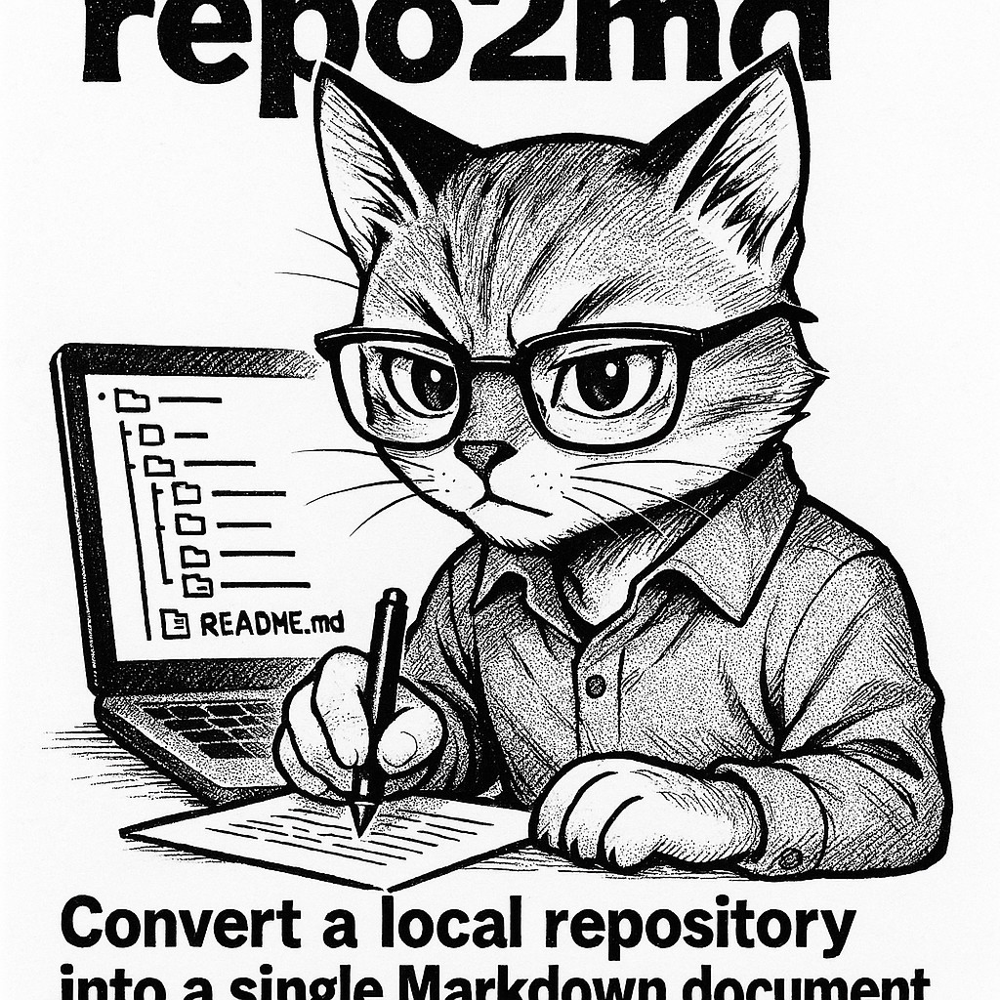

# 📄 repo2md

<p align="center">
  
</p>

🔹 Convert a local repository into a single Markdown document.

📖 **Overview**

`repo2md` is a command-line tool that scans a specified directory, typically a local Git repository, and generates a comprehensive Markdown representation of its structure and content.

It first creates a file tree overview. Then, it iterates through the repository's files, concatenating their content into the Markdown document, wrapped in appropriate code blocks. The tool automatically ignores common directories (like `.git`, `node_modules`) and files (like `.DS_Store`, `.env`), as well as binary files or files exceeding a size limit, to keep the output clean and focused.

🚀 **Installation**

```bash
pipx install . --force
```

🛠️ **Usage**

```bash
# Convert repository in current directory and output to stdout
# (also copies to clipboard if pyperclip is installed)
repo2md

# Convert a specific repository path
repo2md /path/to/your/repository

# Convert repository and copy to clipboard
repo2md /path/to/your/repository --clipboard

# Save output directly to a file
repo2md /path/to/your/repository > output.md
```

📄 **License**

This project is licensed under the MIT License - see the [LICENSE](LICENSE) file for details.