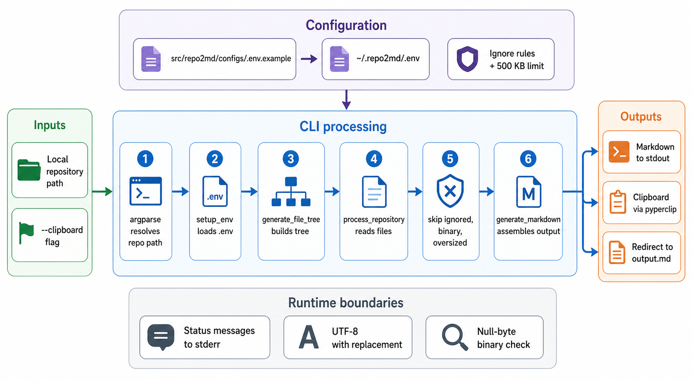

<div align="center">
  

  **📦 Transform any repository into a single Markdown document, perfect for LLM analysis 🤖**
</div>

`repo2md` is a Python CLI that turns a local repository into one Markdown file. It prints a generated file tree followed by the content of every non-ignored text file, which makes a codebase easier to share, archive, or paste into an LLM.

The tool skips common build and dependency folders, ignores binary files, and leaves oversized files out of the generated document.

## Install

Install the published package:

```bash
pipx install repo2md
repo2md
```

Or install from this repository:

```bash
git clone https://github.com/tsilva/repo2md.git
cd repo2md
pipx install . --force
repo2md
```

On first run, `repo2md` creates `~/.repo2md/.env` and exits. Run the command again after that file exists.

## Usage

```bash
repo2md                              # convert the current directory
repo2md /path/to/repository          # convert a specific repository
repo2md /path/to/repository > out.md # save the Markdown output
repo2md /path/to/repository --clipboard
```

## Commands

```bash
pipx install . --force # install the local checkout as a CLI
repo2md                # print Markdown for the current directory
repo2md . --clipboard  # copy output when pyperclip is available
make release-0.1.1     # bump hatch version, commit, and push
```

## Notes

- Output is written to `stdout`; progress and clipboard status are written to `stderr`.
- Files larger than 500 KB are represented by a placeholder instead of full content.
- Binary files are detected by checking for null bytes in the first 1024 bytes.
- Ignored directories include `.git`, `node_modules`, `.vscode`, `dist`, `build`, `.next`, `.cache`, `__pycache__`, `venv`, and `env`.
- Ignored files include `.DS_Store`, `.gitignore`, `.env`, common compiled libraries, Python bytecode, logs, and notebooks.
- Clipboard support is optional. For a `pipx` install, add it with `pipx inject repo2md pyperclip`.

## Architecture



## License

[MIT](LICENSE)
